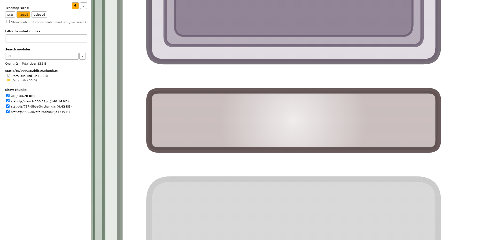
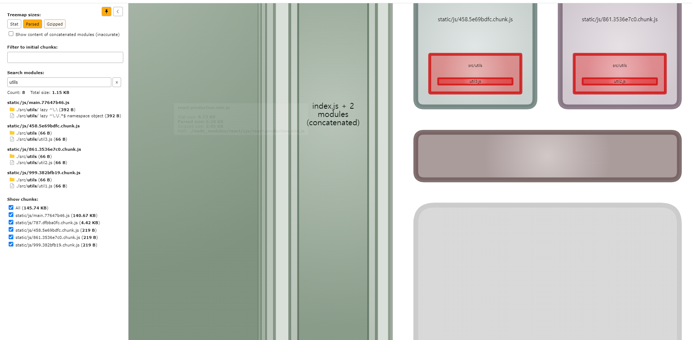
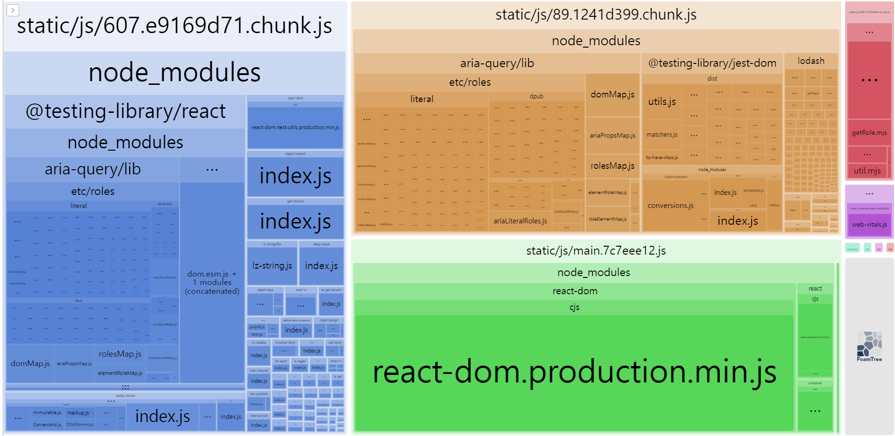
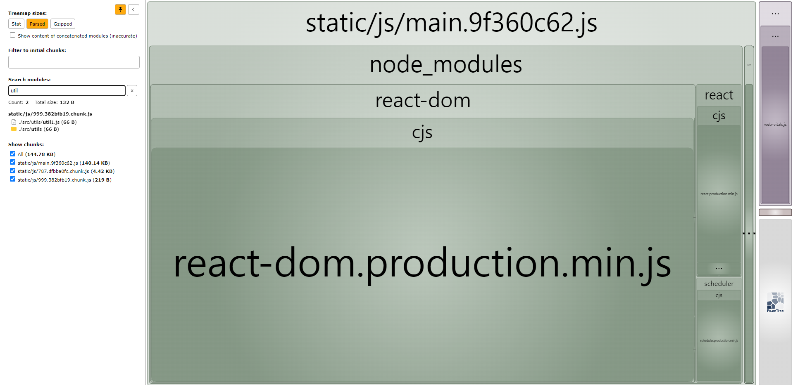
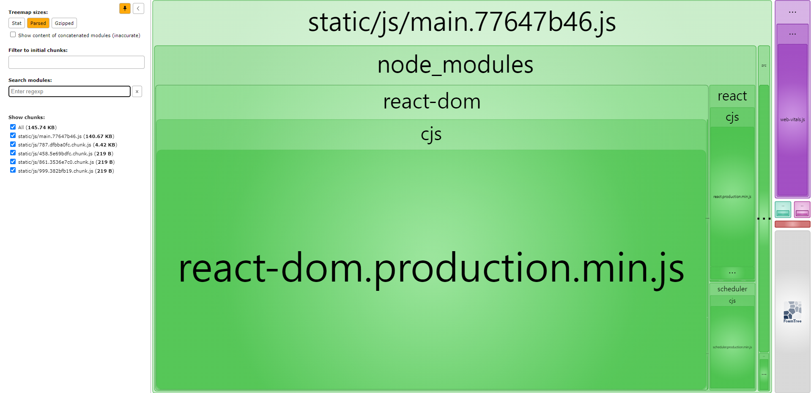
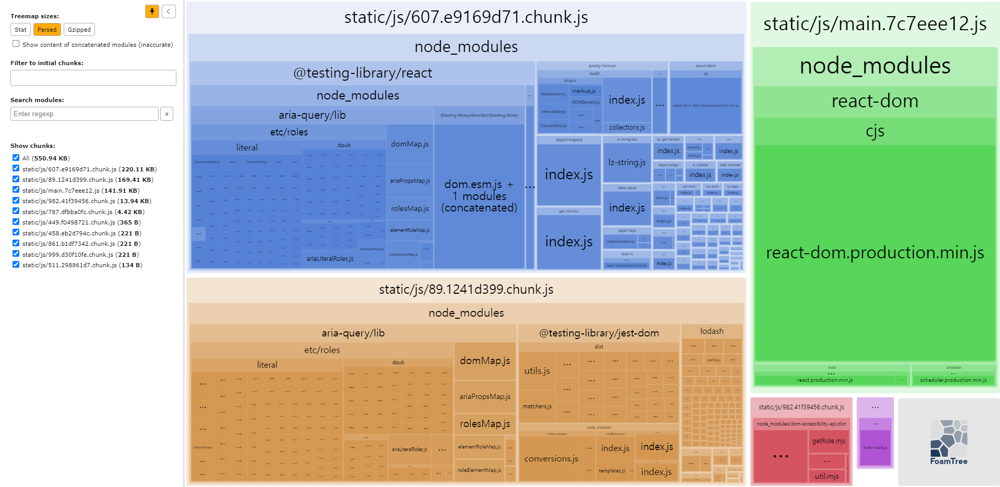

# 웹팩 번들링 과정에서 동적 import 가 여러 형태로 존재할 때 실제로 어떻게 번들링 되는지 확인

# 1. 동적 import 경로가 명시적인 경우

```js
const named = import(`./utils/util1`);
```

utils 하위 util1 만 app.js 에서 분리된 새 청크로 빌드 된다.



-   해당 경로의 모듈만 분리된 청크로 빌드된 모습

# 2. 동적 import 경로에 변수가 일부 포함된 경우

```js
const routeValue = "util1";

`./utils/${routeValue}`;
```

./utils 하위의 모든 모듈들이 app.js 와 분리된 청크들로 빌드된다.



-   util1, util2, util3 이 모두 분리된 청크 파일로 빌드된 모습
-   필요할때 가져오는 코드 스플리팅이 적용된것도 아니고 그냥 모든 파일이 따로 빌드 되어있음

# 32. 동적 import 경로 자체가 변수가 되어버린 경우

```js
const allRoute = "./utils/util1";

const withAllVariables = import(`${allRoute}`);
```



-   그냥 유효한 모든 파일을 대상으로 빌드해버림

-   다른 빌드 결과물과 비교해봐도 뭔가 많고 전체 용량이 크다.

## 1번 (변수가 없을 때)



## 2번 (경로에 변수가 일부 포함되어있을 때)



## 3번 (경로 자체에 변수만 있을 때)



# Getting Started with Create React App

This project was bootstrapped with [Create React App](https://github.com/facebook/create-react-app).

## Available Scripts

In the project directory, you can run:

### `npm start`

Runs the app in the development mode.\
Open [http://localhost:3000](http://localhost:3000) to view it in your browser.

The page will reload when you make changes.\
You may also see any lint errors in the console.

### `npm test`

Launches the test runner in the interactive watch mode.\
See the section about [running tests](https://facebook.github.io/create-react-app/docs/running-tests) for more information.

### `npm run build`

Builds the app for production to the `build` folder.\
It correctly bundles React in production mode and optimizes the build for the best performance.

The build is minified and the filenames include the hashes.\
Your app is ready to be deployed!

See the section about [deployment](https://facebook.github.io/create-react-app/docs/deployment) for more information.

### `npm run eject`

**Note: this is a one-way operation. Once you `eject`, you can't go back!**

If you aren't satisfied with the build tool and configuration choices, you can `eject` at any time. This command will remove the single build dependency from your project.

Instead, it will copy all the configuration files and the transitive dependencies (webpack, Babel, ESLint, etc) right into your project so you have full control over them. All of the commands except `eject` will still work, but they will point to the copied scripts so you can tweak them. At this point you're on your own.

You don't have to ever use `eject`. The curated feature set is suitable for small and middle deployments, and you shouldn't feel obligated to use this feature. However we understand that this tool wouldn't be useful if you couldn't customize it when you are ready for it.

## Learn More

You can learn more in the [Create React App documentation](https://facebook.github.io/create-react-app/docs/getting-started).

To learn React, check out the [React documentation](https://reactjs.org/).

### Code Splitting

This section has moved here: [https://facebook.github.io/create-react-app/docs/code-splitting](https://facebook.github.io/create-react-app/docs/code-splitting)

### Analyzing the Bundle Size

This section has moved here: [https://facebook.github.io/create-react-app/docs/analyzing-the-bundle-size](https://facebook.github.io/create-react-app/docs/analyzing-the-bundle-size)

### Making a Progressive Web App

This section has moved here: [https://facebook.github.io/create-react-app/docs/making-a-progressive-web-app](https://facebook.github.io/create-react-app/docs/making-a-progressive-web-app)

### Advanced Configuration

This section has moved here: [https://facebook.github.io/create-react-app/docs/advanced-configuration](https://facebook.github.io/create-react-app/docs/advanced-configuration)

### Deployment

This section has moved here: [https://facebook.github.io/create-react-app/docs/deployment](https://facebook.github.io/create-react-app/docs/deployment)

### `npm run build` fails to minify

This section has moved here: [https://facebook.github.io/create-react-app/docs/troubleshooting#npm-run-build-fails-to-minify](https://facebook.github.io/create-react-app/docs/troubleshooting#npm-run-build-fails-to-minify)
